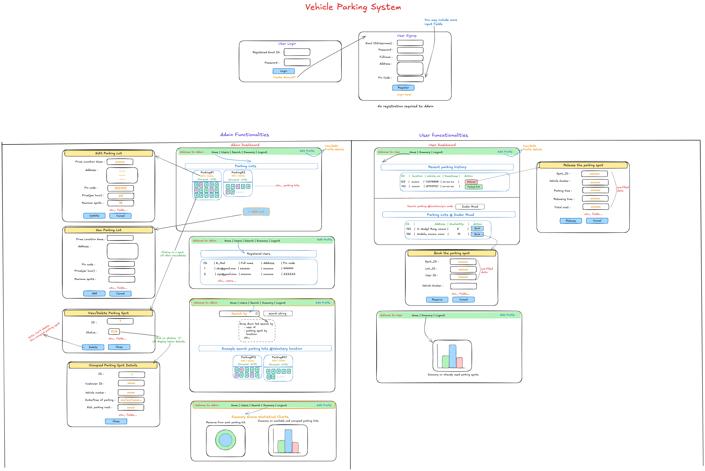

# Vehicle Parking System - v2

A modern, full-stack web application designed to manage parking lots, spots, and vehicle bookings. This system features distinct roles for administrators and users, a real-time dashboard, asynchronous background jobs for reporting, and a sleek, responsive user interface.



---

## Features

### Admin Functionalities

- **Dashboard Overview:** At-a-glance summary of total revenue, live occupancy, and system statistics.
- **Lot Management (CRUD):** Create, view, update, and delete parking lots. The number of spots is automatically generated upon lot creation.
- **Live Spot Viewer:** Visually inspect the status (Available, Reserved, Occupied) of every spot in a lot.
- **Occupied Spot Details:** View booking information for any occupied spot, including user details and parking duration.
- **User Management:** View a list of all registered users and their lifetime statistics.
- **Universal Search:** A powerful search tool to find lots, users, or parked vehicles by number.

### User Functionalities

- **Secure Authentication:** JWT-based authentication with "Remember Me" functionality using secure cookies.
- **Lot Search:** Find available parking lots by name, address, or pin code.
- **Two-Step Booking:** Reserve a spot in advance and then confirm parking upon arrival, accurately tracking both reservation and parking times.
- **Parking Dashboard:** A personal dashboard to view and manage multiple active and reserved sessions simultaneously.
- **Parking History:** A detailed log of all past parking sessions, including duration and cost.
- **Profile Management:** Users can view their statistics and update their personal information.

### Backend & Asynchronous Features

- **Role-Based Access Control (RBAC):** Secure endpoints differentiate between admin and user permissions.
- **Asynchronous Task Processing:** Utilizes Celery and Redis for handling background jobs without blocking the user interface. -**Scheduled Reporting:** (WIP) Automated daily reminders and monthly email reports.
- **CSV Export:** (WIP) User-triggered asynchronous export of their parking data.
- **Performance Caching:** (WIP) Redis is used to cache frequent database queries, improving API response times.

---

## Tech Stack

### Backend

- **Framework:** Flask
- **Database:** SQLite
- **ORM:** Flask-SQLAlchemy
- **Authentication:** Flask-JWT-Extended (handling tokens and cookies)
- **Password Hashing:** Flask-Bcrypt
- **Asynchronous Tasks:** Celery
- **Message Broker & Caching:** Redis
- **API Specification:** RESTful principles

### Frontend

- **Framework:** Vue 3 (using Composition API with `<script setup>`)
- **Routing:** Vue Router
- **Styling:** Bootstrap 5 & `bootstrap-vue-next` for components
- **State Management:** Lightweight global store using Vue's built-in reactivity
- **HTTP Client:** Axios
- **Charting:** Chart.js with `vue-chartjs`
- **Language:** TypeScript

---

## Database Schema

The database consists of four primary models:

- **`User`**: Stores user information, including credentials and role (`user` or `admin`).
- **`ParkingLot`**: Represents a physical parking facility with details like name, address, and price.
- **`ParkingSpot`**: Represents an individual spot within a `ParkingLot`. Its status can be `Available`, or `Occupied`.
- **`Booking`**: Records a transaction, linking a `User` to a `ParkingSpot`. It tracks key timestamps (`booking_time`, `parking_time`, `release_time`) and the final cost.

---

## Prerequisites

- Python 3.8+
- Node.js 16+ and npm
- Redis Server

---

## Installation and Setup

Follow these steps to get the project running locally.

### 1. Backend Setup

```bash
# 1. Navigate to the backend directory
cd backend

# 2. Create and activate a Python virtual environment
python -m venv venv
# On Windows:
venv\Scripts\activate
# On macOS/Linux:
source venv/bin/activate

# 3. Install the required Python packages
pip install -r requirements.txt

# 4. Initialize the database and apply migrations
# This creates the 'migrations' folder
flask db init
# This creates the first migration file based on your models
flask db migrate -m "Initial migration with all models"
# This applies the migration to create the actual .db file and tables
flask db upgrade

# 5. (Optional) Populate the database with sample data
python dump.py
```

### 2. Frontend Setup

```bash
Generated bash
# 1. Navigate to the frontend directory in a new terminal
cd frontend

# 2. Install the required Node.js packages
npm install
```

## Running the Application

You need to run three separate processes in five different terminal windows.

### Terminal 1: Start Redis

```bash
# Start the Redis server (it will run in the foreground)
redis-server
```

### Terminal 2,3: Start the Celery Worker

Make sure you are in the `/backend` directory with your virtual environment activated.

```bash
# Start the Celery worker to process background tasks
celery -A make_celery.celery_app worker --loglevel=info -P solo

# Start the Celery beat scheduler for periodic tasks
celery -A make_celery.celery_app beat --loglevel=info
```

### Terminal 4,5: Start the Backend (Flask) & Frontend (Vue)

```bash
# 1. Navigate to the backend directory
cd backend
# 2. Start the Flask development server
py app.py

# 3. In a new terminal, navigate to the frontend directory
cd frontend
# 4. Start the Vue development server
npm run dev
```

---

## API Endpoints

A brief overview of the primary API endpoints. All are prefixed with `/api`.

- `POST /auth/login`: User and Admin login.
- `POST /auth/register`: New user registration.
- `POST /auth/logout`: User logout, invalidating the JWT token.
- `GET /profile`: Get the logged-in user's profile and stats.
- `PUT /profile`: Update the logged-in user's profile.
- `GET /lots`: Get a list of all parking lots for user search.
- `GET /bookings`: Get all bookings for the logged-in user.
- `GET /booking/{spot_id}`: Get details of a specific booking.
- `POST /reserve`: Reserve a spot in a lot.
- `POST /park/{booking_id}`: Confirm parking for a reservation.
- `POST /release/{booking_id}`: End a parking session and calculate cost.
- `GET /summary`: Get user-specific summary data for the dashboard.
- `POST /export-bookings`: Export user bookings to CSV (WIP).

Admin Endpoints (prefixed with /api/admin)

- `GET /lots`: Get a detailed list of all lots with spot statuses.
- `POST /lots`: Create a new lot.
- `PUT /lots/{lot_id}`: Update a lot.
- `DELETE /lots/{lot_id}`: Delete an empty lot.
- `DELETE /spots/{spot_id}`: Delete a specific parking spot.
- `GET /users`: Get a list of all users with their statistics.
- `GET /summary`: Get aggregated data for the admin dashboard.
- `GET /search`: Unified search for lots, users, or vehicles.
